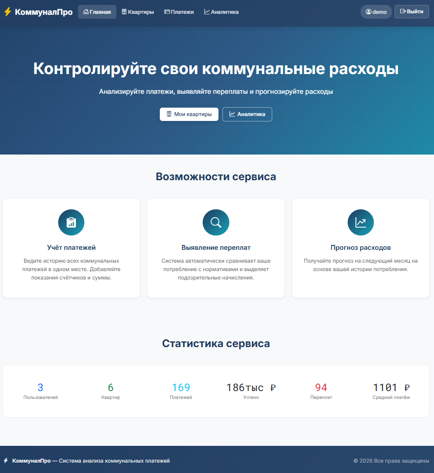
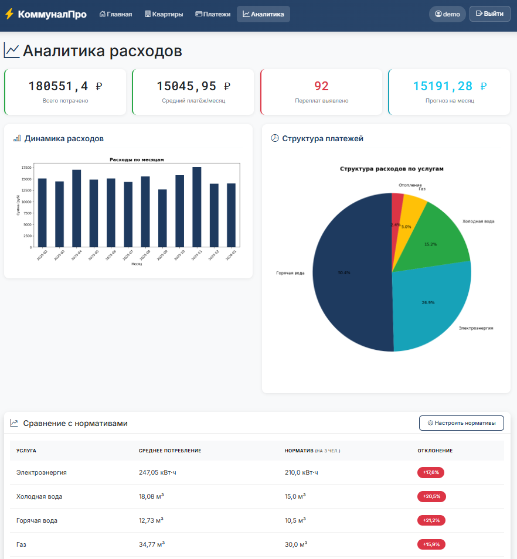
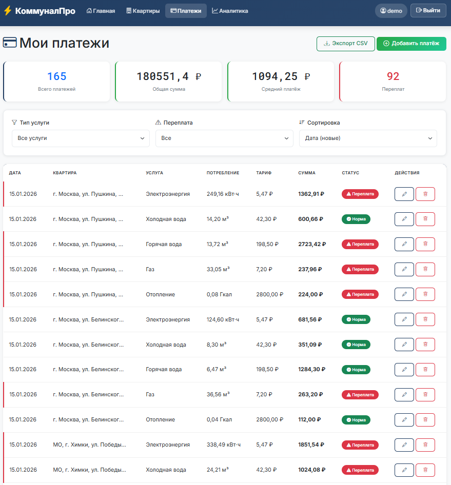

# 💡 КоммуналПро - Система анализа коммунальных платежей

Веб-сервис для жильцов многоквартирных домов, позволяющий отслеживать коммунальные платежи, выявлять переплаты и прогнозировать расходы.

**Демо-версия:** [https://Tennikoff.pythonanywhere.com](https://Tennikoff.pythonanywhere.com)

---

## 🎯 Возможности

- ✅ Учёт нескольких квартир
- ✅ Ведение истории платежей по услугам (электричество, вода, газ, отопление)
- ✅ Автоматическое выявление переплат (сравнение с нормативами)
- ✅ Графики динамики расходов (Matplotlib)
- ✅ Прогноз расходов на следующий месяц
- ✅ Сравнение потребления с нормативами

---

## 🛠 Технологии

- **Backend:** Python 3.14, Django 6.0
- **Database:** SQLite (dev) / PostgreSQL (prod)
- **Data Analysis:** Pandas, Matplotlib
- **Frontend:** Bootstrap 5
- **Deploy:** PythonAnywhere

---

## 📊 Скриншоты

### Главная страница


### Аналитика расходов


### Список платежей


---

## 🚀 Как запустить проект локально

```bash
**1. Клонируйте репозиторий**
git clone https://github.com/Tennikoff/communal-payments-analysis.git
cd communal-payments-analysis

**2. Создайте виртуальное окружение**
python -m venv venv
venv\Scripts\activate  # Windows
source venv/bin/activate  # Linux/Mac
    
**3. Установите зависимости**
pip install -r requirements.txt
    
**4. Выполните миграции**
python manage.py migrate
    
**5. Создайте суперпользователя**
python manage.py createsuperuser
    
**6. Запустите сервер**
python manage.py runserver
    
**7. Откройте в браузере**
http://127.0.0.1:8000/
```

---

### 📁 Структура проекта

communal-payments-analysis/
├── config/              # Настройки Django
├── payments/            # Основное приложение
│   ├── models.py        # Модели: Apartment, ServiceType, PaymentRecord, Tariff
│   ├── views.py         # Логика: CRUD, аналитика
│   ├── forms.py         # Формы Django
│   └── admin.py         # Настройки админки
├── templates/           # HTML шаблоны
├── requirements.txt     # Зависимости
├── TZ.md               # Техническое задание
└── README.md           # Документация

---

👤 Автор
Имя: [Егор]
GitHub: Tennikoff

📄 Лицензия
MIT License